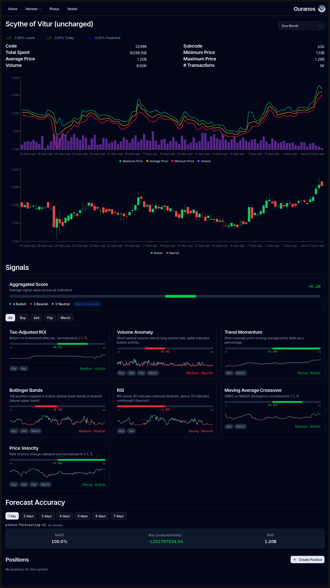
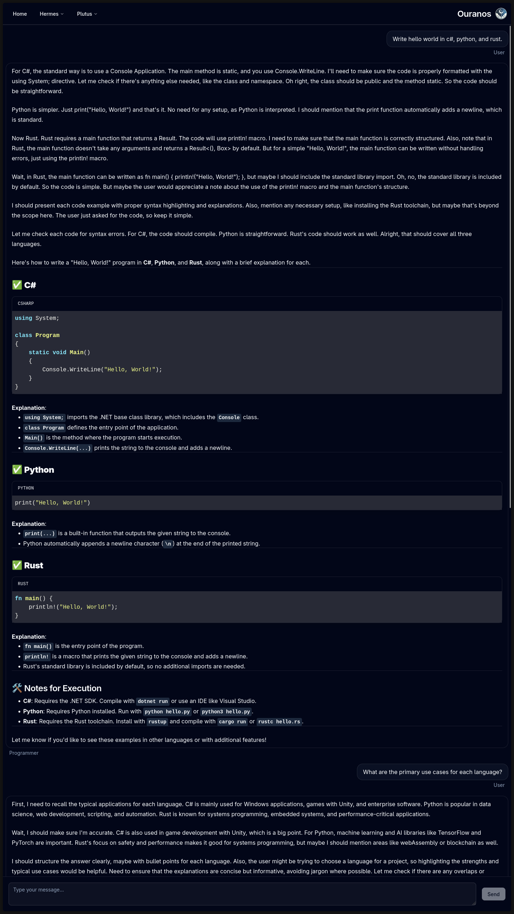
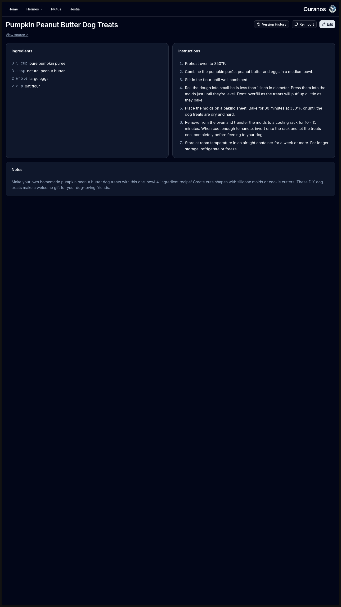

# Ouranos Pantheon

[](LICENSE)
[](https://dotnet.microsoft.com)
[](https://nextjs.org)

An extensible modular monolith platform for building centralized personal services across any domain.

## Overview

Ouranos Pantheon is a personal platform built to grow. It provides a structured foundation - a modular monolith with explicit domain boundaries - that makes it straightforward to add new functionality without touching existing modules. Each module is a self-contained vertical slice; adding a new domain means adding a new module and registering it in the gateway.

The platform currently includes three modules: one for aggregating and analyzing market data across game economies and financial markets, one for interacting with locally-hosted LLMs via a configurable chat interface, and one for managing recipes imported from the web. Future modules can address any domain that benefits from a centralized, always-available personal service.

This project exists to demonstrate modern .NET architecture patterns in a practical, real-world application that actively makes daily life more convenient.

## Modules

### Plutus - Market Data & Analysis

Aggregates trade data from multiple external sources and provides tools for analysis and decision-making.

- Real-time trade ingestion from FFXIV (Universalis), OSRS (Wiki API), and US stock markets (Alpaca)
- Trade snapshots and aggregates across configurable time frames, backed by TimescaleDB continuous aggregates
- Quantitative investment signal analysis (RSI, Bollinger Bands, Moving Average Crossover, Volume Anomaly, and more)
- ML-powered price forecasting via an external inference service
- Configurable trading strategies with backtesting and multi-objective optimization, plus signal-driven position recommendations
- Crafting recipe cost analysis for game economies

### Hermes - AI Chat Assistants

A chat interface for locally-hosted LLMs with configurable assistant profiles.

- Create and manage assistant personas (model, system prompt, temperature, etc.) with reusable traits
- Organize conversations into folders and switch between configured LLM models
- Streaming chat completions

### Hestia - Recipe Management

Manages cooking recipes with full version history and automated import from the web.

- Create and edit recipes (ingredients, steps, notes) with complete change history and one-click revert to any previous version
- Import recipes from recipe websites asynchronously - page metadata is scraped and normalized by a locally-hosted LLM
- Event-sourced persistence using Marten on PostgreSQL

## Architecture

Ouranos Pantheon is a **modular monolith** - a single deployable application composed of isolated domain modules. Each module enforces its own boundaries and communicates through explicit contracts rather than shared state.

Full architecture documentation following the [arc42](https://arc42.org) template lives in [`docs/architecture/`](docs/architecture/README.md), with decision records in [`docs/adr/`](docs/adr/README.md).

**Patterns:** Vertical Slice Architecture · Domain-Driven Design · Message-driven data pipelines · Event Sourcing (Marten)

**Module contract:** Every module implements `IPantheonModule`, which provides hooks for service registration, middleware configuration, and endpoint mapping. The gateway composes all registered modules at startup.

**Data flow:** External APIs → Data loader workers → RabbitMQ → Consumer → PostgreSQL → REST API → Next.js dashboard

**Persistence:** Modules own their storage - Plutus uses EF Core with TimescaleDB hypertables and continuous aggregates, while Hestia uses event sourcing with Marten.

## Tech Stack

| Category   | Technologies                                        |
| ---------- | --------------------------------------------------- |
| Backend    | .NET, ASP.NET Core Minimal APIs, EF Core, Marten    |
| Frontend   | Next.js, React, TypeScript, Tailwind CSS, Zustand   |
| Data       | PostgreSQL (TimescaleDB)                            |
| Messaging  | RabbitMQ, Wolverine                                 |
| Scheduling | TickerQ                                             |

## Project Structure

```
src/
  apps/
    gateway/          # REST API host - composes all modules
    interface/        # Next.js dashboard
  modules/
    plutus/           # Market data, trades, signals, forecasts, strategies
    hermes/           # AI chat assistants
    hestia/           # Recipes with version history and web import
    shared/           # Cross-cutting infrastructure
tests/
automation/           # Git hooks (pre-commit formatting, pre-push build)
```

## Getting Started

### Prerequisites

- .NET SDK
- Node.js
- Infrastructure: PostgreSQL, RabbitMQ - the recommended setup is the Docker Compose configuration in the [ouranos-infrastructure](https://github.com/davwales/ouranos-infrastructure) repository

### Backend

```bash
dotnet restore
dotnet build Ouranos.Pantheon.sln
```

Override connection strings and API keys in the relevant `appsettings.json` files before running.

### Frontend

```bash
cd src/apps/interface
npm install
npm run dev
```

## Screenshots





## Contributing

This is a personal project and portfolio showcase. I am not currently accepting contributions.

That said, you are welcome to fork the repository, explore the architecture, or draw inspiration from any patterns you find useful.
