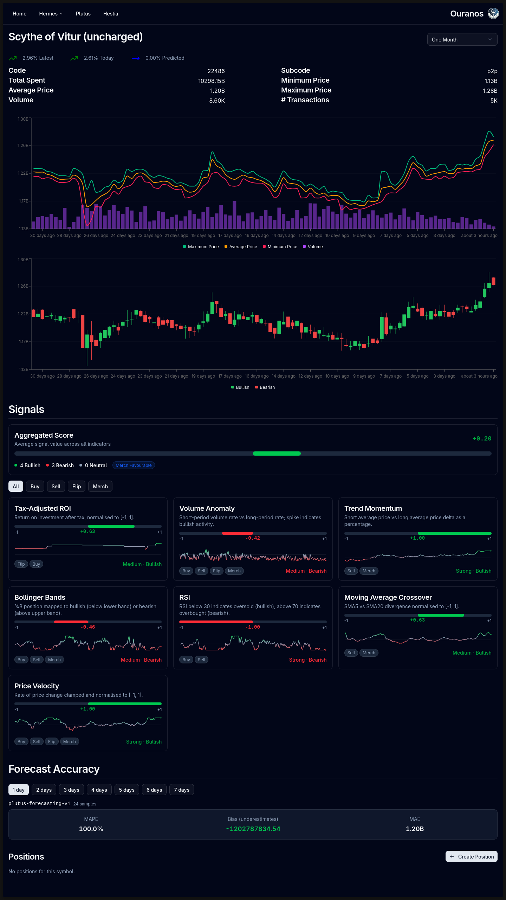
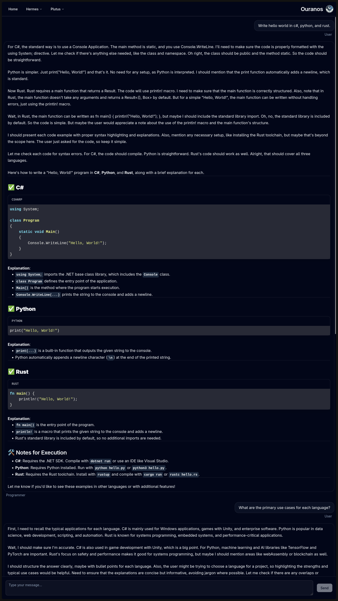
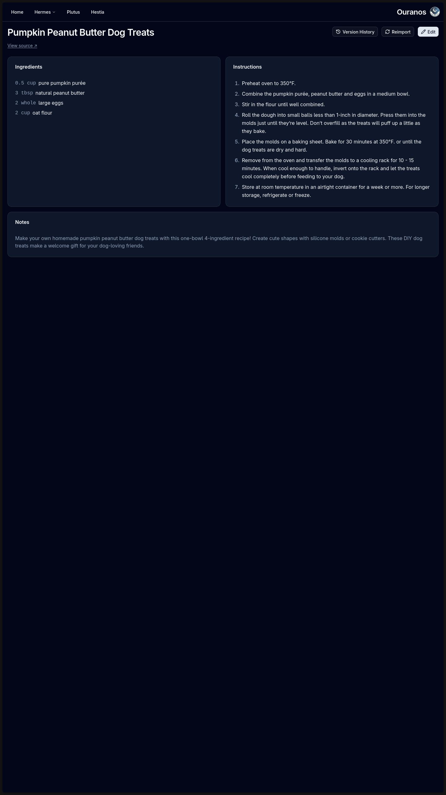

# Ouranos Pantheon

[](LICENSE)
[](https://dotnet.microsoft.com)
[](https://nextjs.org)

An extensible modular monolith platform for building centralized personal services across any domain.

## Overview

Ouranos Pantheon is a personal platform built to grow. It provides a structured foundation - a modular monolith with explicit domain boundaries - that makes it straightforward to add new functionality without touching existing modules. Each module is a self-contained vertical slice; adding a new domain means adding a new module and registering it in the gateway.

The platform currently includes three modules: one for aggregating and analyzing market data across game economies and financial markets, one for interacting with locally-hosted LLMs via a configurable chat interface, and one for managing recipes imported from the web. Future modules can address any domain that benefits from a centralized, always-available personal service.

This project exists to demonstrate modern .NET architecture patterns in a practical, real-world application that actively makes daily life more convenient.

## Modules

### Plutus - Market Data & Analysis

Aggregates trade data from multiple external sources and provides tools for analysis and decision-making.

- Real-time trade ingestion from FFXIV (Universalis) and US stock markets (Alpaca), plus OSRS (Wiki API) polled every 5 minutes
- Trade snapshots and aggregates across configurable time frames, backed by TimescaleDB continuous aggregates
- Quantitative investment signal analysis (RSI, Bollinger Bands, Moving Average Crossover, Volume Anomaly, and more)
- ML-powered price forecasting via an external inference service
- Configurable trading strategies with backtesting and multi-objective optimization, plus signal-driven recommendations
- Manually recorded positions
- Crafting recipe cost analysis for game economies

### Hermes - AI Chat Assistants

A chat interface for locally-hosted LLMs with configurable assistant profiles.

- Create and manage assistant personas (model, system prompt, temperature, etc.) with reusable traits
- Organize conversations into folders and switch between configured LLM models
- Streaming chat completions, automatic conversation naming, and compaction of long chats into a summary
- A public mode (feature flag) that hides non-public data, for demos

### Hestia - Recipe Management

Manages cooking recipes with full version history and automated import from the web.

- Create and edit recipes (ingredients, steps, notes) with complete change history and one-click revert to any previous version
- Import recipes from recipe websites asynchronously - page metadata is scraped and normalized by a locally-hosted LLM
- A shopping list built from selected recipes plus manual items
- Event-sourced recipe persistence using Marten on PostgreSQL

## Architecture

Ouranos Pantheon is a **modular monolith** - a single deployable application composed of isolated domain modules. Modules do not reference or call each other; each depends only on the shared kernel and owns its own database schema.

Full architecture documentation following the [arc42](https://arc42.org) template lives in [`docs/architecture/`](docs/architecture/README.md), with decision records in [`docs/adr/`](docs/adr/README.md).

**Patterns:** Vertical Slice Architecture · Domain-Driven Design · Message-driven data pipelines · Event Sourcing (Marten)

**Module contract:** Every module implements `IPantheonModule`, which provides hooks for service registration, startup configuration, endpoint mapping, and message routing. The gateway composes all registered modules at startup.

**Data flow:** External APIs → Data loader workers → RabbitMQ → Consumer → PostgreSQL → REST API → Next.js dashboard

**Persistence:** Modules own their storage - Plutus and Hermes use EF Core (Plutus with TimescaleDB hypertables and continuous aggregates), while Hestia uses Marten (event-sourced recipes, a document for the shopping list).

## Tech Stack

| Category      | Technologies                                                |
| ------------- | ----------------------------------------------------------- |
| Backend       | .NET, ASP.NET Core Minimal APIs, Wolverine, EF Core, Marten |
| Frontend      | Next.js, React, TypeScript, Tailwind CSS, Zustand           |
| Data          | PostgreSQL (TimescaleDB)                                    |
| Messaging     | RabbitMQ, Wolverine                                         |
| Scheduling    | TickerQ                                                     |
| Feature flags | Flagsmith                                                   |
| Observability | Serilog, OpenTelemetry                                      |

## Project Structure

```
src/
  apps/
    gateway/          # REST API host - composes all modules
    interface/        # Next.js dashboard
  modules/
    plutus/           # Market data, trades, signals, forecasts, strategies
    hermes/           # AI chat assistants
    hestia/           # Recipes with version history, web import, shopping list
    shared/           # Shared kernel (Shared.Contract) and cross-cutting infrastructure (Shared)
tests/                # Unit tests mirroring src/
docs/                 # arc42 architecture documentation and ADRs
bruno/                # Bruno API request collection
automation/           # Git hooks (pre-commit format check, pre-push build), format.sh
```

The pre-commit hook only *checks* formatting; run `automation/format.sh` to apply it.

## Getting Started

### Prerequisites

- .NET SDK (see `global.json`)
- Node.js
- Infrastructure: PostgreSQL with the TimescaleDB extension, RabbitMQ, Flagsmith - the recommended setup is the Docker Compose configuration in the [ouranos-infrastructure](https://github.com/davwales/ouranos-infrastructure) repository
- For Hermes and Hestia AI features: an OpenAI-compatible inference service (OuranosMl)

### Configuration

Local settings go in `src/apps/gateway/Ouranos.Pantheon.Apps.Gateway/appsettings.Development.json` (gitignored); see `appsettings.json` in the same folder for every key under the `Ouranos:` root.

> **Every data loader defaults to enabled.** Set `Ouranos:Plutus:DataLoaders:<Ffxiv|Osrs|Stocks|Consumer>:IsEnabled` to `false` for any loader you do not want running against live external APIs.

### Backend

```bash
dotnet restore
dotnet build Ouranos.Pantheon.sln
dotnet run --project src/apps/gateway/Ouranos.Pantheon.Apps.Gateway   # http profile, http://localhost:8300
```

Migrations for every module are applied automatically at startup.

### Frontend

```bash
cd src/apps/interface
npm ci
npm run dev        # http://localhost:3000
```

The dashboard calls the gateway at `NEXT_PUBLIC_API_BASE` / `NEXT_PUBLIC_API_HOST` and falls back to `http://localhost:8300`.

### Tests

```bash
dotnet test                               # backend (CI enforces 85% line coverage)
cd src/apps/interface && npm run test     # frontend (Vitest)
```

## Screenshots





## Contributing

This is a personal project and portfolio showcase. I am not currently accepting contributions.

That said, you are welcome to fork the repository, explore the architecture, or draw inspiration from any patterns you find useful.
