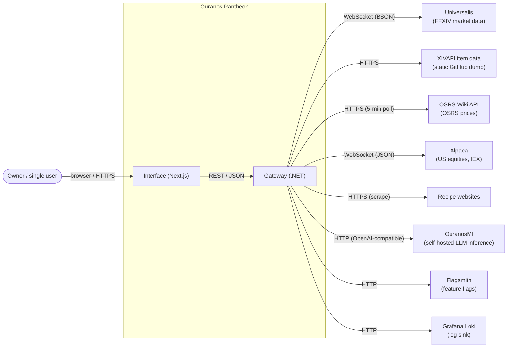

# 3. Context and Scope

## 3.1 Business Context

Ouranos Pantheon is a single-user personal platform. One human (the owner) interacts with
the system through a web dashboard. The system aggregates market data from external game
and stock data providers, enriches it with signals and forecasts, and exposes analysis,
backtesting, chat, and recipe management.

**Roles:**

- **Owner**: the only actor. Consumes the dashboard and, indirectly, the REST API.
- **Data providers**: supply market data; the system is a pure consumer.
- **OuranosMl**: a separately hosted inference service used by all three modules
  (chat for Hermes, recipe normalization for Hestia, price forecasting for Plutus).
- **Flagsmith / Loki**: supporting platform services (feature flags, log aggregation).

## 3.2 Technical Context

| External system | Channel | Protocol / format | Purpose | Code entry point |
|-----------------|---------|-------------------|---------|------------------|
| Universalis | Outbound WSS | `wss://universalis.app/api/ws`, BSON frames | Real-time FFXIV sale events | `Features/DataLoaders/Ffxiv/` (Plutus) |
| XIVAPI item data | Outbound HTTPS | JSON files on `raw.githubusercontent.com` | Static FFXIV item metadata | `Features/DataLoaders/Ffxiv/XivApi/` (Plutus) |
| OSRS Wiki API | Outbound HTTPS | JSON, polled every 5 minutes | OSRS prices and item mappings | `Features/DataLoaders/Osrs/OsrsWikiClient.cs` (Plutus) |
| Alpaca (IEX feed) | Outbound WSS | `wss://stream.data.alpaca.markets/v2/iex`, JSON | Real-time US equity trades | `Features/DataLoaders/Stocks/` (Plutus) |
| OuranosMl | Outbound HTTP | OpenAI-compatible (chat, streaming, structured output) + `POST /plutus/forecast` | LLM chat, recipe normalization, price forecasting | `Shared.Contract/Infra/OuranosMachineLearning/` (Shared kernel) |
| Flagsmith | Outbound HTTP | REST | Feature flags | `Infra/Flagsmith/` (Shared module) |
| Recipe websites | Outbound HTTPS | HTML with JSON-LD metadata | Recipe import | `Features/Recipes/ImportRecipe/Scraping/RecipeScraper.cs` (Hestia) |
| Grafana Loki | Outbound HTTP | Push API | Production log sink | `appsettings.Production.json` (gateway) |
| Browser | Inbound HTTPS | Next.js UI, REST + JSON | Dashboard | `src/apps/interface/` |

Note: MongoDB.Bson is used as a **BSON parser only** for Universalis frames. No MongoDB
server is involved anywhere in the system.

## 3.3 Scope

**In scope (this repository):**

- The gateway application (REST API host composing all modules)
- The Next.js dashboard
- All four modules: Shared, Hermes, Plutus, Hestia, including their data loaders,
  consumers, scheduled jobs, persistence, and migrations
- CI pipelines and Docker images

**Out of scope:**

- Infrastructure provisioning (PostgreSQL/TimescaleDB, RabbitMQ, Flagsmith, Loki,
  OuranosMl) are owned by the `ouranos-infrastructure` repository
- The ML models and serving stack behind OuranosMl, a separate system consumed here
  only through its OpenAI-compatible HTTP surface
- The upstream APIs themselves; the system adapts to their free-tier behavior

## 3.4 Security Posture

The gateway is intentionally unauthenticated: it runs on a trusted home network for a
single known user. The exposed surface is protected by network location, a CORS
allow-list (`CorsAllowedHosts`), and an anti-SSRF guard on the recipe scraper. Secrets
for Alpaca and other services are configured via `appsettings.*.json` / environment.
This posture follows an explicit decision,
[ADR 0008](../adr/0008-no-authentication-single-user.md), but it is not meant to be
permanent: authentication is planned for demo purposes, and when it lands a new ADR
will supersede 0008.