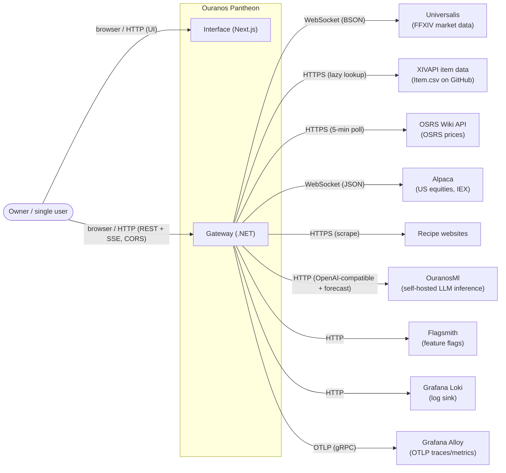

# 3. Context and Scope

## 3.1 Business Context

Ouranos Pantheon is a single-user personal platform. One human (the owner) interacts with
the system through a web dashboard. The system aggregates market data from external game
and stock data providers, enriches it with signals and forecasts, and exposes analysis,
backtesting, chat, and recipe management.

```mermaid
graph LR
    owner([Owner / single user])

    subgraph pantheon["Ouranos Pantheon"]
        interface["Interface (Next.js)"]
        gateway["Gateway (.NET)"]
    end

    universalis["Universalis<br/>(FFXIV market data)"]
    xivapi["XIVAPI item data<br/>(Item.csv on GitHub)"]
    osrs["OSRS Wiki API<br/>(OSRS prices)"]
    alpaca["Alpaca<br/>(US equities, IEX)"]
    recipeSites["Recipe websites"]
    ouranosMl["OuranosMl<br/>(self-hosted LLM inference)"]
    flagsmith["Flagsmith<br/>(feature flags)"]
    loki["Grafana Loki<br/>(log sink)"]
    alloy["Grafana Alloy<br/>(OTLP traces/metrics)"]

    owner -- "browser / HTTP (UI)" --> interface
    owner -- "browser / HTTP (REST + SSE, CORS)" --> gateway

    gateway -- "WebSocket (BSON)" --> universalis
    gateway -- "HTTPS (lazy lookup)" --> xivapi
    gateway -- "HTTPS (5-min poll)" --> osrs
    gateway -- "WebSocket (JSON)" --> alpaca
    gateway -- "HTTPS (scrape)" --> recipeSites
    gateway -- "HTTP (OpenAI-compatible + forecast)" --> ouranosMl
    gateway -- HTTP --> flagsmith
    gateway -- HTTP --> loki
    gateway -- "OTLP (gRPC)" --> alloy
```

The Next.js app only serves the UI; its pages run in the browser and call the gateway
directly, which is why the gateway has a CORS allow-list.

**Roles:**

- **Owner**: the only actor. Uses the dashboard, whose browser code calls the REST API.
- **Data providers**: supply market data; the system is a pure consumer.
- **OuranosMl**: a separately hosted inference service used by all three modules
  (chat for Hermes, recipe normalization for Hestia, price forecasting for Plutus).
- **Flagsmith / Loki / Grafana Alloy**: supporting platform services (feature flags, log
  aggregation, trace and metric collection).

## 3.2 Technical Context

Code entry points are given relative to the owning module's project folder
(`src/modules/<module>/Ouranos.Pantheon.Modules.<Module>/`), or repo-relative for apps.

| External system | Channel | Protocol / format | Purpose | Code entry point |
|-----------------|---------|-------------------|---------|------------------|
| Universalis | Outbound WSS | `wss://universalis.app/api/ws`, BSON frames | Real-time FFXIV sale events | Plutus: `Features/DataLoaders/Ffxiv/` |
| XIVAPI item data | Outbound HTTPS | CSV on `raw.githubusercontent.com`, fetched lazily and cached | FFXIV item names for incoming sale events | Plutus: `Features/DataLoaders/Ffxiv/XivApi/` |
| OSRS Wiki API | Outbound HTTPS | JSON, polled every 5 minutes | OSRS prices and item mappings | Plutus: `Features/DataLoaders/Osrs/OsrsWikiClient.cs` |
| Alpaca (IEX feed) | Outbound WSS | `wss://stream.data.alpaca.markets/v2/iex`, JSON | Real-time US equity trades | Plutus: `Features/DataLoaders/Stocks/` |
| OuranosMl | Outbound HTTP | OpenAI-compatible (chat, streaming, structured output) + `POST /plutus/forecast` | LLM chat, recipe normalization, price forecasting | Shared.Contract: `Infra/OuranosMachineLearning/` |
| Flagsmith | Outbound HTTP | REST | Feature flags | Shared: `Infra/Flagsmith/` |
| Recipe websites | Outbound HTTPS | HTML with JSON-LD metadata | Recipe import | Hestia: `Features/Recipes/ImportRecipe/Scraping/RecipeScraper.cs` |
| Grafana Loki | Outbound HTTP | Push API | Production log sink | Gateway: `appsettings.Production.json` |
| Grafana Alloy | Outbound gRPC | OTLP | Trace and metric export (production; see [ADR 0009](../adr/0009-opentelemetry-observability-via-otlp.md)) | Shared: `Infra/Observability/` |
| PostgreSQL / TimescaleDB | Outbound TCP | Npgsql (EF Core, Marten, TickerQ) | All persistence, schema per module | Shared.Contract: `Infra/Postgres/` |
| RabbitMQ | Outbound AMQP | Wolverine RabbitMQ transport | Async messages (trades, backtests, recipe import) | Shared: `API/Extensions/CoreExtensions.cs` |
| Browser | Inbound HTTP | Next.js UI; REST + JSON and SSE from the gateway | Dashboard | `src/apps/interface/` |

Note: MongoDB.Bson is used as a **BSON parser only** for Universalis frames. No MongoDB
server is involved anywhere in the system.

## 3.3 Scope

**In scope (this repository):**

- The gateway application (REST API host composing all modules)
- The Next.js dashboard
- All four modules: Shared, Hermes, Plutus, Hestia, including their data loaders,
  consumers, scheduled jobs, persistence, and migrations
- CI pipelines and Docker images

**Out of scope:**

- Infrastructure provisioning (PostgreSQL/TimescaleDB, RabbitMQ, Flagsmith, Loki,
  Grafana Alloy) is owned by the `ouranos-infrastructure` repository
  ([ADR 0011](../adr/0011-container-images-on-ghcr.md))
- OuranosMl: the ML models and serving stack are a separate system on a separate host,
  consumed here only through its HTTP surface
- The upstream APIs themselves; the system adapts to their free-tier behavior

## 3.4 Security Posture

The gateway is intentionally unauthenticated: it runs on a trusted home network for a
single known user. The exposed surface is protected by network location, a CORS
allow-list (`CorsAllowedHosts`), and an anti-SSRF guard on the recipe scraper. Secrets
for Alpaca and other services are configured via `appsettings.*.json` / environment.
This posture follows an explicit decision,
[ADR 0008](../adr/0008-no-authentication-single-user.md), but it is not meant to be
permanent: authentication is planned for demo purposes, and when it lands a new ADR
will supersede 0008.
