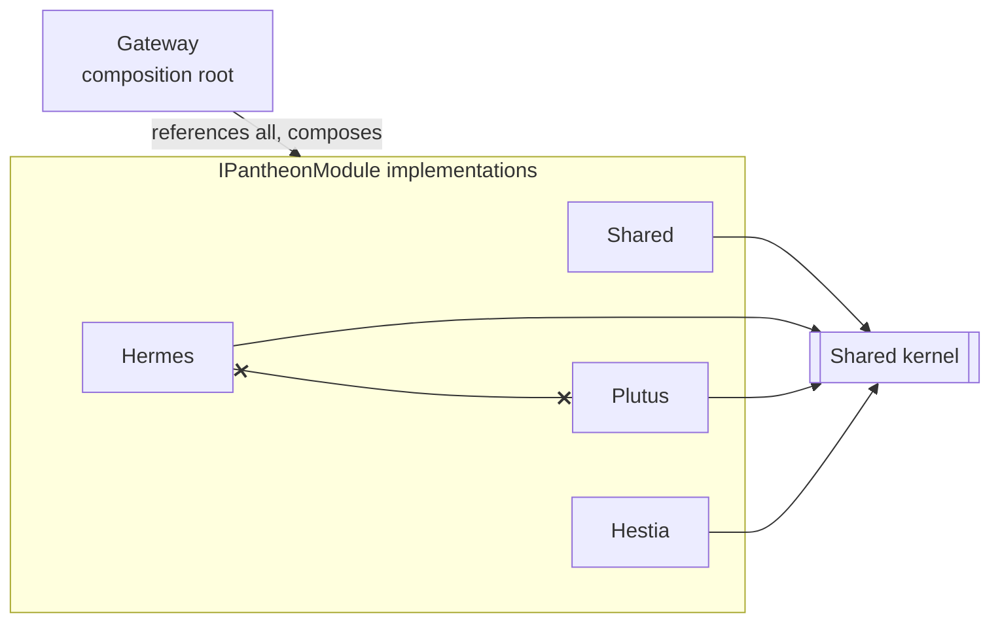

# 4. Solution Strategy

This section summarizes the fundamental approaches chosen to meet the quality goals of
[Section 1.2](01-introduction-and-goals.md#12-quality-goals). Each approach links to its full
decision record under [`docs/adr/`](../adr/README.md).

| Approach | How it meets the goals | ADR |
|----------|------------------------|-----|
| **Modular monolith**: one deployable, domain-isolated modules behind an `IPantheonModule` contract | Extensibility (Q1): adding a domain is a module + one registration line. Operational simplicity (Q3): no distributed-systems overhead. Design clarity (Q2): boundaries are explicit and inspectable | [0001](../adr/0001-modular-monolith-over-microservices.md) |
| **Vertical Slice Architecture + DDD inside each module** | Design clarity (Q2): every feature is readable end-to-end (handler → endpoint → schemas); DDD aggregates keep invariants with the data | [0002](../adr/0002-vertical-slice-architecture-with-wolverine.md) |
| **Wolverine-mediated in-process dispatch** | Design clarity (Q2): slices never reference each other; discovery is convention-based over handler markers | [0002](../adr/0002-vertical-slice-architecture-with-wolverine.md) |
| **Schema-per-module on one PostgreSQL instance** | Extensibility (Q1) + simplicity (Q3): modules cannot leak into each other's data, yet there is only one database to run | [0003](../adr/0003-schema-per-module-database-isolation.md) |
| **Polyglot persistence on one engine**: TimescaleDB hypertables/continuous aggregates for time-series (Plutus), Marten event sourcing for Hestia | Each module picks the persistence style its domain needs without adding infrastructure (Q3) | [0004](../adr/0004-polyglot-persistence-on-postgresql.md) |
| **Message-driven ingestion & async work**: Wolverine + RabbitMQ with per-message exchanges, queues, and DLQs | Durability and back-pressure for high-volume trade data; 202-accept-then-poll for long-running backtests | [0005](../adr/0005-wolverine-rabbitmq-for-async-pipelines.md) |
| **In-process scheduling via TickerQ** | Simplicity (Q3): recurring jobs live with the code and keep their state in the same Postgres | [0006](../adr/0006-tickerq-for-scheduling.md) |
| **Self-hosted AI inference (OuranosMl) behind one client** | All three modules get LLM/ML capability through a single OpenAI-compatible dependency; no cloud AI cost or lock-in | [0007](../adr/0007-self-hosted-llm-inference-via-ouranosml.md) |
| **No authentication, trusted-network posture** | Simplicity (Q3) for a single-user, private-network system | [0008](../adr/0008-no-authentication-single-user.md) |

## 4.1 The Module Contract in One Picture

The crossed line is the system's most important structural rule: **modules do not
reference each other**, and they share only the kernel ([Section 5](05-building-block-view.md)).

## 4.2 Trade-Offs Accepted

- **Monolith scaling**: vertical scaling only; acceptable for one user
  ([Section 2](02-architecture-constraints.md)).
- **Folder-enforced boundaries**: one assembly per module means the compiler does not
  enforce internal module layering; conventions and review do.
- **Operational coupling**: all modules deploy together; a bad change in one module
  ships for all. Mitigated by CI (85% coverage gate) and per-module tests.
- **Single-broker runtime**: Wolverine + RabbitMQ for everything; no per-module broker
  isolation.