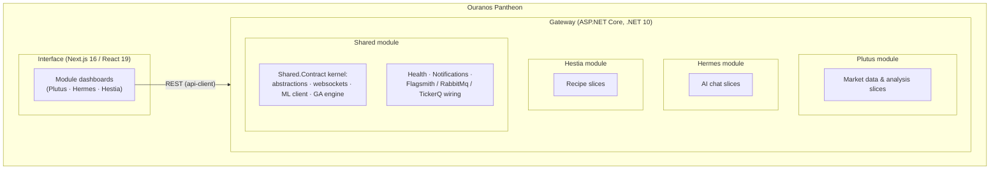

# 5. Building Block View

## 5.1 Whitebox Overall System

Ouranos Pantheon is a **modular monolith**: one .NET host (the *Gateway*) composes all
modules into a single deployable, plus a separate Next.js *Interface* application.



The diagram shows containment only; the feature slices inside each module are enumerated
in the whitebox sections below.

### Composition mechanics

The Gateway is a thin composition root. `HostingExtensions.cs`
(`src/apps/gateway/.../Startup/`) declares the module array and delegates to two
extension methods in the Shared module (`CoreExtensions.cs`):

```csharp
private static readonly IReadOnlyList<IPantheonModule> Modules =
[
    new SharedModule(),
    new HermesModule(),
    new PlutusModule(),
    new HestiaModule(),
];
```

- `AddOuranosCore(builder.Configuration, Modules)`: configures Serilog, REST conventions,
  Flagsmith, Wolverine (with handler discovery across **all** module assemblies and each
  module's `ConfigureWolverine` hook), TickerQ, and shared health checks; then calls
  `Build` on every module.
- `UseOuranosCore(app, Modules)`: migrates the TickerQ store, maps every module's
  endpoints (`MapEndpoints`), and runs each module's async configuration (`Configure`).

Adding a domain means adding a module and one line to this array; nothing else in the
gateway changes. All data-loader workers and scheduled jobs run as in-process hosted
services inside the gateway process; the two images (gateway, interface) are the whole
system.

### Module invariants

1. **No module references another module's assembly.** Each module `.csproj` references
   only `Ouranos.Pantheon.Modules.Shared.Contract`. Only the Gateway references all
   modules.
2. **One assembly per module.** Plutus is a single project; boundaries are enforced by
   folder layout and review rather than by project splitting.
3. **The kernel contains no domain logic.** `Shared.Contract` holds only abstractions and
   generic infrastructure (see [Section 8](08-crosscutting-concepts.md)).
4. **In-process handler dispatch.** All endpoints go through Wolverine's `IMessageBus`;
   no module ever calls another module's handler type directly.

### How building blocks relate

Slices never reference each other, so the static dependency graph between feature folders
is nearly empty by design. Within a module, all coupling is data coupling: async
handoffs travel over RabbitMQ (`plutus.trade`, `plutus.backtest`, `hestia.recipe`; see
[Section 8](08-crosscutting-concepts.md)), and everything else is one slice reading what
another has written to the module's own Postgres schema. Across modules the only shared
things are the kernel and the gateway composition. The meaningful interactions are
therefore dynamic; see the scenarios in [Section 6](06-runtime-view.md).

## 5.2 Blackbox: Interface (`src/apps/interface`)

Next.js App Router dashboard. Talks to the Gateway exclusively through a typed
`api-client` (`src/lib/api-client.ts`) pointed at `NEXT_PUBLIC_API_BASE`. State is held in
Zustand stores (`src/stores/`, e.g. `plutus-store.ts`). Pages compose feature components
from per-route component folders (`_components/`).

## 5.3 Whitebox: Plutus (market data & analysis)

It ingests, aggregates, analyzes, and acts on market data for FFXIV, OSRS,
and US equities.

| Building block | Responsibility |
|----------------|----------------|
| `Features/DataLoaders/` | Ingestion: FFXIV and Stocks WebSocket listeners, OSRS poller, XIVAPI item sync; the trade consumer upserts symbols and writes trades |
| `Features/Markets/` | Market catalog CRUD; markets are the root entity the rest of the module is scoped to |
| `Features/Symbols/` | Symbol read access: list/get symbols (upserted by ingestion) and today's per-symbol summary statistics |
| `Features/Trades/` | Trade queries and aggregate views over the TimescaleDB hypertable and continuous aggregates: all trades, per-symbol/market/recipe trade aggregates, market overview, volume heatmap (see [Section 8](08-crosscutting-concepts.md)) |
| `Features/Signals/` | Signal computation via pluggable registered signal computers covering technical and game-economy indicators; scheduling in [Section 6](06-runtime-view.md) |
| `Features/Strategies/` | Configurable strategies (input weights, buy/sell thresholds), backtesting as a step pipeline, genetic-algorithm optimization over multiple objectives; the backtest lifecycle (run, optimize, get, cancel, restart) lives here too |
| `Features/Forecasts/` | ML price forecasts via OuranosMl and forecast efficacy evaluation |
| `Features/Positions/` | Positions and signal-driven recommendations |
| `Features/SymbolGroups/` | CRUD for named groupings of symbols within a market |
| `Features/Recipes/` | CRUD for crafting recipes (input/output components, cost) that back the per-recipe trade aggregation and cost analysis |
| `Shared/Domain/` | Market, Symbol, Trade, Recipe, Signal, Strategy, Backtest, Position, Forecast entities |

Interfaces: REST routes per feature in `bruno/ouranos-pantheon/collections/API/Plutus/`.
Async work runs over RabbitMQ: trades (`plutus.trade`) and backtest/optimize runs
(`plutus.backtest`); topology in [Section 8](08-crosscutting-concepts.md).

## 5.4 Whitebox: Hermes (AI chat)

Chat interface over locally hosted LLMs.

| Building block | Responsibility |
|----------------|----------------|
| `Features/Conversations/` | Conversation and message persistence, streaming chat completions via OuranosMl |
| `Features/Personas/` | Reusable assistant personality definitions applied to conversations |
| `Features/Traits/` | Attachable traits that merge with the conversation's persona at prompt-build time |
| `Features/Models/` | Model configuration CRUD and available-model sync from OuranosMl |
| `Features/Folders/` | Folders for organizing conversations |

Interfaces: REST routes in `bruno/ouranos-pantheon/collections/API/Hermes/`; no async
messaging.

## 5.5 Whitebox: Hestia (recipes)

Recipe management with event-sourced persistence.

| Building block | Responsibility |
|----------------|----------------|
| `Features/Recipes/` | Recipe CRUD with full version history and revert, persisted as a Marten event stream per recipe |
| `Features/Recipes/ImportRecipe/` | Async import: enqueue an import request → scrape the page (JSON-LD, anti-SSRF-guarded) → LLM-normalize via OuranosMl structured output → append events |
| `Features/ShoppingLists/` | Shopping list items derived from recipes |

Interfaces: REST routes in `bruno/ouranos-pantheon/collections/API/Hestia/`. The async
import handoff is the `hestia.recipe` exchange (see
[Section 8](08-crosscutting-concepts.md)).

## 5.6 Whitebox: Shared

Two distinct things live under `src/modules/shared/`:

**`Ouranos.Pantheon.Modules.Shared.Contract`** is the shared kernel referenced by every
module: `Id<T>`, `BaseEntity`, `BaseEventSourcedEntity`, `IPantheonHandler`, the common
query contract (paging/sorting/filtering), the backtest step pipeline abstractions, the
`WebSocketWorker` infrastructure, the OuranosMl client, the genetic-algorithm engine, the
`PostgresModule`/`OuranosDbContext` persistence core, and the Marten registration helper
(`AddCoreMartenModule`, used by Hestia). See
[Section 8](08-crosscutting-concepts.md).

**`Ouranos.Pantheon.Modules.Shared`** is a runnable module (the first entry in the
gateway's module array) that owns: the health endpoint + checks (Postgres, RabbitMQ,
OuranosMl, WebSocket, TickerQ), the TickerQ store migrations and dashboard, notification
entities and dispatch job, and Flagsmith/RabbitMQ option wiring.

## 5.7 Tests

`tests/` mirrors `src/` (`tests/modules/{plutus,hermes,hestia,shared}`,
`tests/apps/`, `tests/Ouranos.Pantheon.Tests.Utils/`). Stack: xUnit + AutoFixture +
NSubstitute + Shouldly, EF Core InMemory for data tests.
