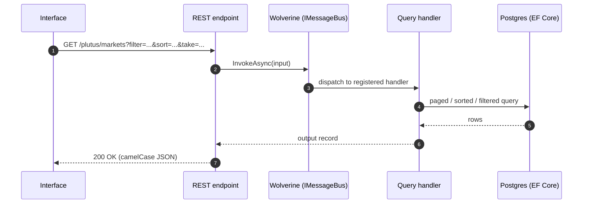
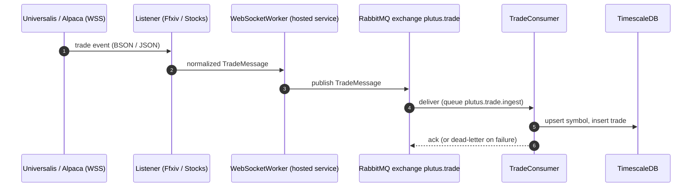
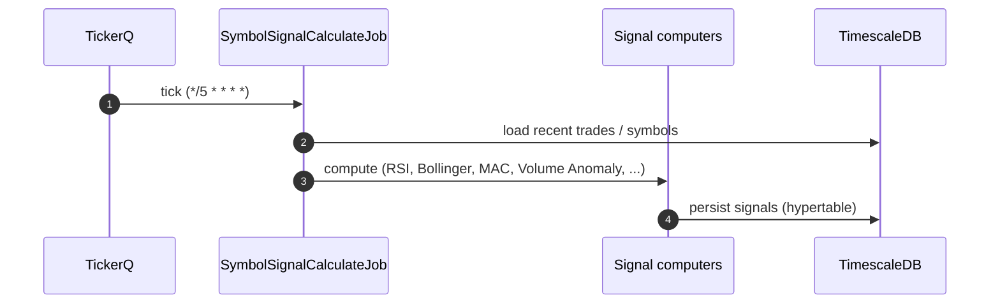
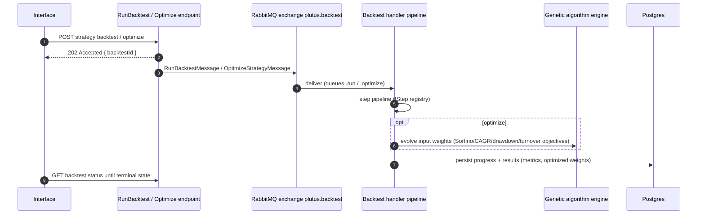
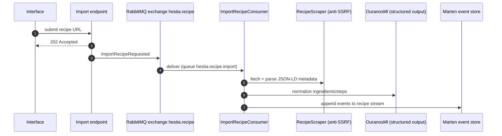
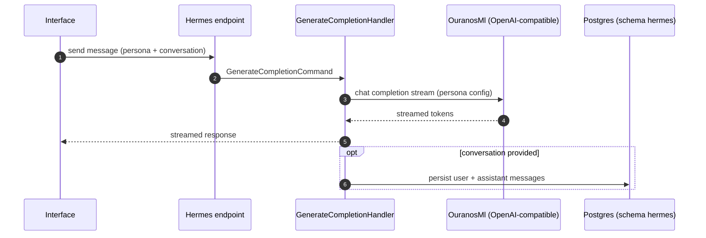

# 6. Runtime View

This section traces the system's key scenarios. All of them are driven by the building
blocks of [Section 5](05-building-block-view.md) and the conventions of
[Section 8](08-crosscutting-concepts.md).

## 6.1 Scheduled Jobs Overview

Recurring work is coordinated by TickerQ jobs (all in-process, with an EF Core-backed
store, dashboard at `/tickerq/dashboard`):

| Job | Module | Schedule | Purpose |
|-----|--------|----------|---------|
| `OsrsDataLoaderJob` | Plutus | every 5 min | Poll OSRS Wiki prices → publish `TradeMessage`s |
| `SymbolSignalCalculateJob` | Plutus | every 5 min | Recompute signals for all symbols |
| `ForecastGeneratorJob` | Plutus | daily | Generate price forecasts via OuranosMl |
| `SyncModelsJob` | Hermes | hourly | Sync available LLM models from OuranosMl |
| `NotificationSenderJob` | Shared | every second | Dispatch pending notifications |

## 6.2 Scenario: Plain Query Request

*The bread-and-butter flow every list endpoint follows.*

Paging, sorting, and the `field:op:value` filter language follow the common query contract
from [Section 8.2](08-crosscutting-concepts.md#82-application-patterns); failures surface
as RFC 7807 problem details ([Section 8.6](08-crosscutting-concepts.md#86-errors-and-validation)).

## 6.3 Scenario: Real-Time Trade Ingestion

*The continuous pipeline that turns external market events into queryable aggregates.*

The OSRS variant replaces steps 1–2 with `OsrsDataLoaderJob` polling on a 5-minute
schedule. Continuous aggregates keep market views query-ready without query-time
aggregation.

## 6.4 Scenario: Signal Calculation and Forecasting

*Every five minutes, computed signals refresh the analytical surface.*

The daily `ForecastGeneratorJob` follows the same shape but calls OuranosMl
(`POST /plutus/forecast`) and persists `Forecast` records; forecast efficacy is then
evaluated against realized trades.

## 6.5 Scenario: Backtest / Optimization Run

*An HTTP-triggered, long-running computation executed asynchronously.*

The 202-Accepted-then-poll contract is what the Interface relies on. Cancel and restart follow the same message shape over
`plutus.backtest` (the `CancelBacktest`/`RestartBacktest` slices).

## 6.6 Scenario: Recipe Import

*An end-to-end AI-assisted ingestion flow in Hestia.*

## 6.7 Scenario: Streaming Chat

## 6.8 Observability at Runtime

Health is exposed via module-registered checks (Postgres, RabbitMQ, OuranosMl, WebSocket
connectivity, TickerQ). Structured Serilog logs flow to Loki in production. There is no
OpenTelemetry instrumentation yet. That gap is recorded as debt in
[Section 11](11-risks-and-technical-debt.md).
