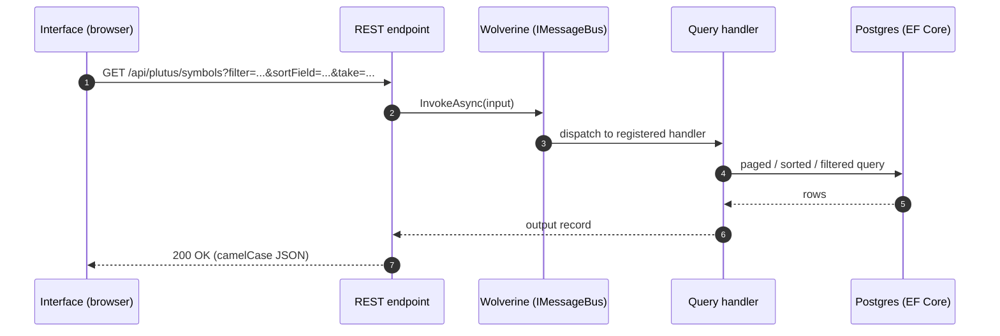
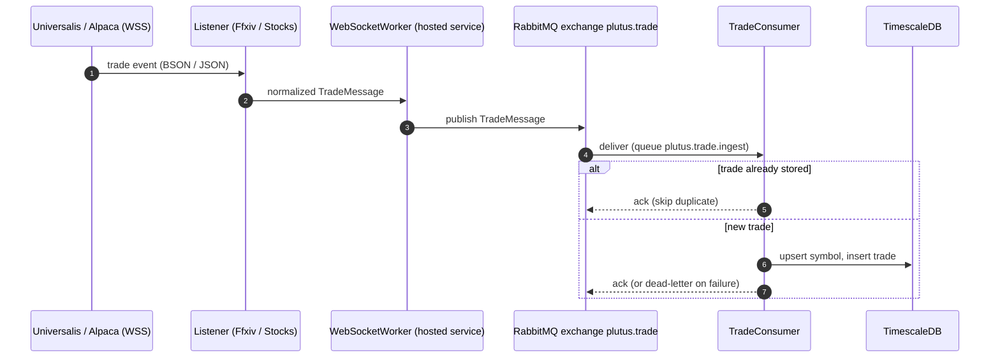
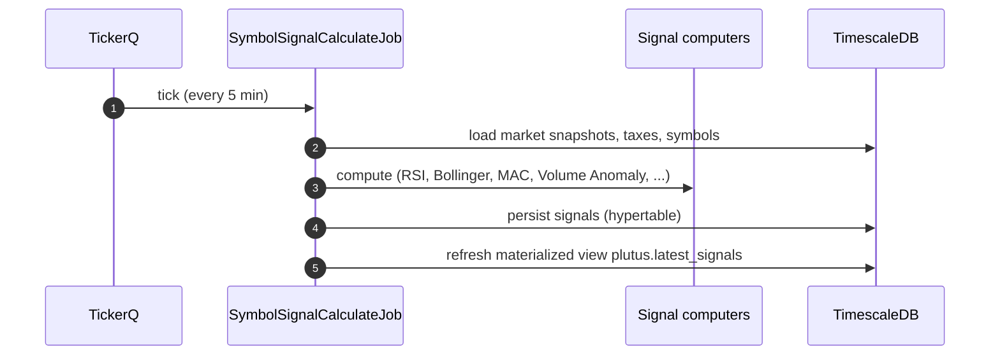
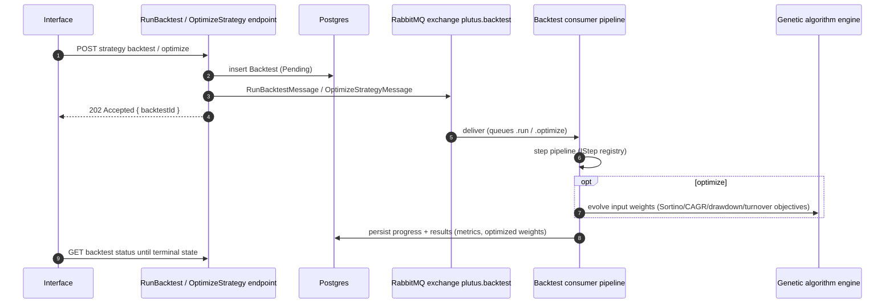
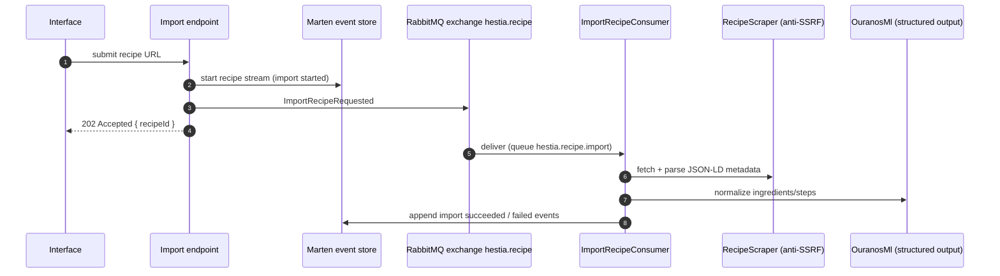
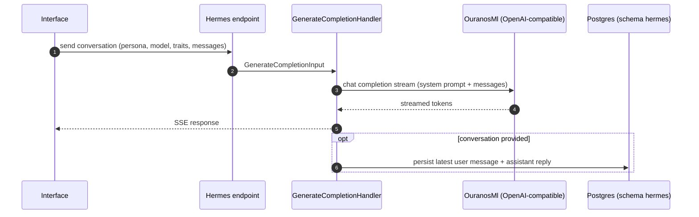
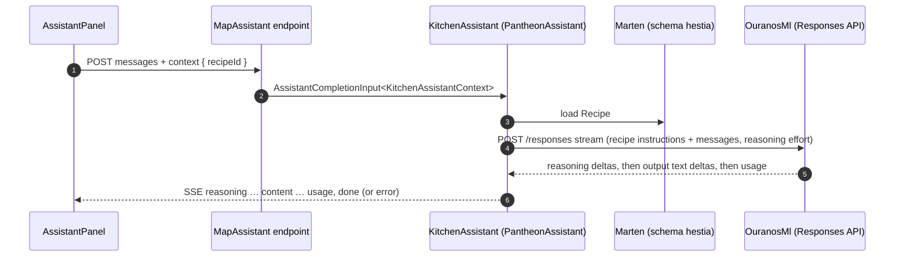

# 6. Runtime View

This section traces the system's key scenarios. All of them are driven by the building
blocks of [Section 5](05-building-block-view.md) and the conventions of
[Section 8](08-crosscutting-concepts.md).

## 6.1 Scheduled Jobs Overview

Recurring work is coordinated by TickerQ jobs (all in-process, with an EF Core-backed
store, dashboard at `/tickerq/dashboard`). Names are the TickerQ function names shown in
the dashboard:

| Job | Module | Schedule | Purpose |
|-----|--------|----------|---------|
| `OsrsDataLoaderJob` | Plutus | every 5 min | Poll OSRS Wiki prices → publish `TradeMessage`s |
| `SymbolSignalCalculate` | Plutus | every 5 min | Recompute signals for all symbols and refresh `plutus.latest_signals` |
| `ForecastGenerator` | Plutus | daily | Generate price forecasts via OuranosMl |
| `SyncModelsJob` | Hermes | hourly | Sync available LLM models from OuranosMl |
| `NotificationSender` | Shared | every minute | Dispatch pending notifications |

## 6.2 Scenario: Plain Query Request

*The bread-and-butter flow every list endpoint follows.*

```mermaid
sequenceDiagram
    autonumber
    participant UI as Interface (browser)
    participant EP as REST endpoint
    participant B as Wolverine (IMessageBus)
    participant H as Query handler
    participant DB as Postgres (EF Core)

    UI ->> EP: GET /api/plutus/symbols?filter=...&sortField=...&take=...
    EP ->> B: InvokeAsync(input)
    B ->> H: dispatch to registered handler
    H ->> DB: paged / sorted / filtered query
    DB -->> H: rows
    H -->> EP: output record
    EP -->> UI: 200 OK (camelCase JSON)
```

Paging, sorting, and the `field:op:value` filter language follow the common query contract
from [Section 8.2](08-crosscutting-concepts.md#82-application-patterns); error handling is
described in [Section 8.6](08-crosscutting-concepts.md#86-errors-and-validation).

## 6.3 Scenario: Real-Time Trade Ingestion

*The continuous pipeline that turns external market events into queryable aggregates.*

```mermaid
sequenceDiagram
    autonumber
    participant U as Universalis / Alpaca (WSS)
    participant L as Listener (Ffxiv / Stocks)
    participant W as WebSocketWorker (hosted service)
    participant X as RabbitMQ exchange plutus.trade
    participant C as TradeConsumer
    participant DB as TimescaleDB

    U ->> L: trade event (BSON / JSON)
    L ->> W: normalized TradeMessage
    W ->> X: publish TradeMessage
    X ->> C: deliver (queue plutus.trade.ingest)
    alt trade already stored
        C -->> X: ack (skip duplicate)
    else new trade
        C ->> DB: upsert symbol, insert trade
        C -->> X: ack (or dead-letter on failure)
    end
```

Trades missed while a WebSocket is disconnected are not replayed. The OSRS variant replaces
steps 1–2 with `OsrsDataLoaderJob` polling on a 5-minute schedule; it retries when the
Wiki has not published a new bucket yet and records the last processed bucket in
`OsrsDataLoaderState`. Continuous aggregates keep market views query-ready without
query-time aggregation.

## 6.4 Scenario: Signal Calculation and Forecasting

*Every five minutes, computed signals refresh the analytical surface.*

```mermaid
sequenceDiagram
    autonumber
    participant T as TickerQ
    participant J as SymbolSignalCalculateJob
    participant SC as Signal computers
    participant DB as TimescaleDB

    T ->> J: tick (every 5 min)
    J ->> DB: load market snapshots, taxes, symbols
    J ->> SC: compute (RSI, Bollinger, MAC, Volume Anomaly, ...)
    J ->> DB: persist signals (hypertable)
    J ->> DB: refresh materialized view plutus.latest_signals
```

The daily `ForecastGenerator` job calls OuranosMl (`POST /plutus/forecast`) in batches for
markets with forecasting enabled and persists a `ForecastRun` with its `Forecast` and
`ForecastRecord` rows. No job evaluates forecasts: efficacy is computed on request by
joining forecast records to realized daily prices.

## 6.5 Scenario: Backtest / Optimization Run

*An HTTP-triggered, long-running computation executed asynchronously.*

```mermaid
sequenceDiagram
    autonumber
    participant UI as Interface
    participant EP as RunBacktest / OptimizeStrategy endpoint
    participant DB as Postgres
    participant X as RabbitMQ exchange plutus.backtest
    participant C as Backtest consumer pipeline
    participant GA as Genetic algorithm engine

    UI ->> EP: POST strategy backtest / optimize
    EP ->> DB: insert Backtest (Pending)
    EP ->> X: RunBacktestMessage / OptimizeStrategyMessage
    EP -->> UI: 202 Accepted { backtestId }
    X ->> C: deliver (queues .run / .optimize)
    C ->> C: step pipeline (IStep registry)
    opt optimize
        C ->> GA: evolve input weights (Sortino/CAGR/drawdown/turnover objectives)
    end
    C ->> DB: persist progress + results (metrics, optimized weights)
    UI ->> EP: GET backtest status until terminal state
```

The 202-Accepted-then-poll contract is what the Interface relies on. The rest of the
lifecycle:

- **Cancel** only sets the status to `Cancelled`; the running consumer notices on its
  next progress check and stops. No message is published.
- **Restart** resets a `Failed` or `Cancelled` backtest to `Pending` in place (same id)
  and republishes a run message.
- **Startup recovery** marks backtests left `Running` by a previous process as `Failed`.

## 6.6 Scenario: Recipe Import

*An end-to-end AI-assisted ingestion flow in Hestia.*

```mermaid
sequenceDiagram
    autonumber
    participant UI as Interface
    participant EP as Import endpoint
    participant M as Marten event store
    participant X as RabbitMQ exchange hestia.recipe
    participant C as ImportRecipeConsumer
    participant S as RecipeScraper (anti-SSRF)
    participant ML as OuranosMl (structured output)

    UI ->> EP: submit recipe URL
    EP ->> M: start recipe stream (import started)
    EP ->> X: ImportRecipeRequested
    EP -->> UI: 202 Accepted { recipeId }
    X ->> C: deliver (queue hestia.recipe.import)
    C ->> S: fetch + parse JSON-LD metadata
    C ->> ML: normalize ingredients/steps
    C ->> M: append import succeeded / failed events
```

Import failures are appended to the stream as `RecipeImportFailed` events. `ReimportRecipe` reruns the same flow for an existing recipe.

## 6.7 Scenario: Streaming Chat

```mermaid
sequenceDiagram
    autonumber
    participant UI as Interface
    participant EP as Hermes endpoint
    participant H as GenerateCompletionHandler
    participant ML as OuranosMl (OpenAI-compatible)
    participant DB as Postgres (schema hermes)

    UI ->> EP: send conversation (persona, model, traits, messages)
    EP ->> H: GenerateCompletionInput
    H ->> ML: chat completion stream (system prompt + messages)
    ML -->> H: streamed tokens
    H -->> UI: SSE response
    opt conversation provided
        H ->> DB: persist latest user message + assistant reply
    end
```

The server is stateless with respect to chat history: the client sends the whole
conversation on every request, and the handler persists only the newest turn.

### Module assistants

Module assistants (e.g. the Hestia Kitchen Assistant) follow the same stateless pattern
but own their prompt: the client sends only messages and a typed context reference.

```mermaid
sequenceDiagram
    autonumber
    participant UI as AssistantPanel
    participant EP as MapAssistant endpoint
    participant A as KitchenAssistant (PantheonAssistant)
    participant ES as Marten (schema hestia)
    participant ML as OuranosMl (Responses API)

    UI ->> EP: POST messages + context { recipeId }
    EP ->> A: AssistantCompletionInput<KitchenAssistantContext>
    A ->> ES: load Recipe
    A ->> ML: POST /responses stream (recipe instructions + messages, reasoning effort)
    ML -->> A: reasoning deltas, then output text deltas, then usage
    A -->> UI: SSE reasoning … content … usage, done (or error)
```

## 6.8 Observability at Runtime

Health is exposed via centrally registered checks (Postgres, RabbitMQ, OuranosMl, WebSocket
connectivity, TickerQ). Structured Serilog logs flow to Loki in production. OpenTelemetry
traces and metrics cover the full request and background-process surface - HTTP,
Wolverine messaging, TickerQ jobs, websocket loaders, database calls, and the .NET
runtime - exported over OTLP to the Grafana stack
([Section 8.14](08-crosscutting-concepts.md#814-observability-opentelemetry),
[ADR 0009](../adr/0009-opentelemetry-observability-via-otlp.md)).
