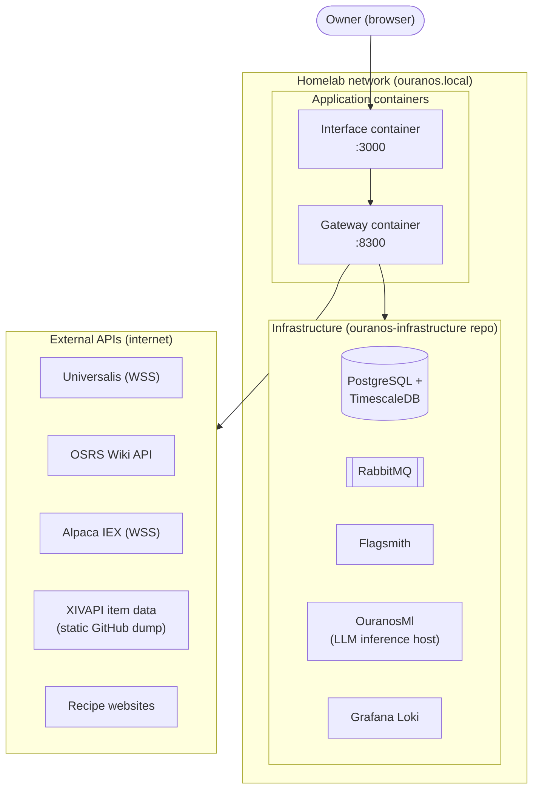
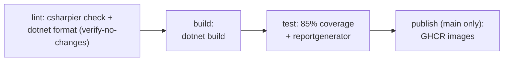

# 7. Deployment View

## 7.1 Deployment Artifacts

Exactly two container images are built and published (`.github/workflows/ci.yml`,
`publish` job, `main` branch only):

| Image | Base | Port | Source |
|-------|------|------|--------|
| `ghcr.io/davwales/ouranos-pantheon/gateway` | `aspnet:10.0` | 8300 | `src/apps/gateway/Dockerfile` |
| `ghcr.io/davwales/ouranos-pantheon/interface` | `node:22-alpine` | 3000 | `src/apps/interface/Dockerfile` |

Pushes use buildx with a registry cache (`:cache` tag) and `GITHUB_TOKEN`, so there are no registry
secrets.

## 7.2 Environment Topology

Infrastructure (PostgreSQL/TimescaleDB, RabbitMQ, Flagsmith, Loki, OuranosMl) is
provisioned by the separate [`ouranos-infrastructure`](https://github.com/davwales/ouranos-infrastructure)
repository via Docker Compose. This repository assumes those services exist and configures
connections through `appsettings.*.json`; service hostnames (e.g. the Loki sink target
`loki-gateway:3100`) come from that compose project's DNS names.

## 7.3 Configuration Surface

| Concern | Mechanism |
|---------|-----------|
| Connection strings (Postgres, RabbitMQ, OuranosMl, Flagsmith, Loki) | `appsettings.*.json` per environment, overridable by environment variables |
| CORS allow-list | `CorsAllowedHosts` array (policy `AllowLocalAndServer`) |
| Wolverine retry policy | `RabbitMq:RetryCount` (the policy is registered only when it is set): cooldown retries for unexpected exceptions, immediate dead-letter for `ArgumentException`/`InvalidOperationException` |
| Query defaults | `Ouranos:Query` section (`QueryOptions`: paging/sorting limits behind the common query contract) |
| Data loaders | `Plutus:DataLoaders` enable flags |
| Feature flags | Flagsmith environments (dev at `ouranos.local:8001`) |
| Frontend API base | `NEXT_PUBLIC_API_BASE` / `NEXT_PUBLIC_API_HOST` (default `http://localhost:8300`) |

## 7.4 CI/CD

The lint and build jobs also run the frontend steps (`npm run lint`, `npm run build`).
There is no automated
deployment step: promoting a release (pulling new images on the homelab host) is a manual
operation, consistent with the single-operator constraint of
[Section 2](02-architecture-constraints.md).
