# 10. Quality Requirements

## 10.1 Quality Tree

Quality goals from [Section 1.2](01-introduction-and-goals.md#12-quality-goals),
decomposed:

```mermaid
graph TB
    root["Platform quality"]

    ext["Extensibility (Q1)"]
    clar["Design clarity (Q2)"]
    ops["Operational simplicity (Q3)"]

    root --> ext
    root --> clar
    root --> ops

    ext1["New domain =<br/>new module only"] --> ext
    ext2["No cross-module<br/>assembly references"] --> ext
    ext3["Shared kernel stays<br/>domain-free"] --> ext

    clar1["Every decision has<br/>a recorded rationale"] --> clar
    clar2["Feature = one readable<br/>vertical slice"] --> clar
    clar3["Docs updated with<br/>architectural change"] --> clar

    ops1["One deployable +<br/>one compose stack"] --> ops
    ops2["85% coverage gate<br/>in CI"] --> ops
    ops3["Health checks for all<br/>critical dependencies"] --> ops
    ops4["Auto-provisioned<br/>messaging topology"] --> ops
```

## 10.2 Quality Scenarios

Draft scenarios, each concrete and verifiable against the running system:

| # | Scenario | Metric / target |
|---|----------|-----------------|
| S1 | **Add a new domain module** | Time from empty project to first working endpoint without touching existing modules; validated by the module contract (kernel reference only) |
| S2 | **Trade ingestion resilience** | When an external WebSocket drops, the `WebSocketWorker` reconnects; no trade loss beyond the outage window; messages fail into `.dlq` rather than disappearing |
| S3 | **Backtest responsiveness** | An HTTP backtest submission returns 202 in < 1 s; the computation proceeds asynchronously with persisted progress visible in `GET /backtests/{id}` |
| S4 | **Query consistency** | Every list endpoint supports the same paging/sorting/filter contract |
| S5 | **Regression safety** | CI rejects any change dropping line coverage below 85% |
| S6 | **Dependency health visibility** | All critical dependencies (Postgres, RabbitMQ, OuranosMl, WebSocket connectivity, TickerQ) are observable via health checks |
