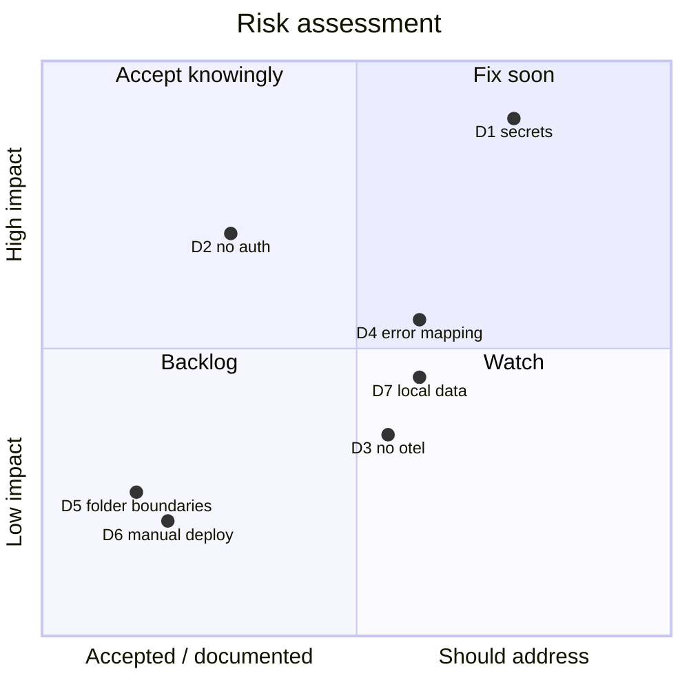

# 11. Risks and Technical Debt

Debt and risks identified while documenting the architecture. Severity is a proposal;
the owner decides what gets fixed and what gets accepted.

| # | Item | Where | Risk / impact | Proposed severity |
|---|------|-------|---------------|-------------------|
| D1 | **Secrets in plaintext config**: Alpaca API key/secret and a Flagsmith environment key sit unencrypted in local configuration | gateway `appsettings.Development.json`; `ouranos-infrastructure` repo, `stacks/pantheon/.env` | No secrets manager anywhere in the stack; exposure via host compromise, accidental check-in, or environment inspection; key rotation is manual | High |
| D2 | **No authentication**: gateway is open by design | [ADR 0008](../adr/0008-no-authentication-single-user.md) | Any host on the home network has full write access (delete strategies, import recipes); acceptable while network is trusted | Accepted (documented) |
| D3 | **No OpenTelemetry / metrics**: observability is Serilog logs + health checks only | [Section 6.8](06-runtime-view.md#68-observability-at-runtime) | Harder diagnosis of ingestion lag, backtest throughput, LLM latency | Medium |
| D4 | **No exception→status mapping**: only the framework's `AddProblemDetails()` is registered; guard exceptions are unmapped, so a missing entity returns a bare 500 with no problem-details body instead of 404 | [Section 8.6](08-crosscutting-concepts.md#86-errors-and-validation) | Client errors are indistinguishable from server faults; the error contract stays accidental as the API grows | Medium |
| D5 | **Folder-enforced module boundaries**: single assembly per module; internal layering not compiler-enforced | [Section 5](05-building-block-view.md) | A shortcut could couple module internals without failing the build | Low (accepted trade-off) |
| D6 | **Manual deployment step**: images are published by CI but promotion to the homelab is manual | [Section 7.4](07-deployment-view.md#74-cicd) | Deploy drift, forgotten migrations (mitigated: migrations run at startup) | Low |
| D7 | **No fast path to realistic local Plutus data**: data-heavy local work (signals, backtests) rides on full prod restores (large `pg_dump`s, slow dump/restore cycles); faking data is unexplored and risks diverging from real market distributions | Local development data flow | Slow iteration on data-heavy features; synthetic-data shortcuts could mislead signal/backtest tuning | Medium |

## 11.1 Risk Radar

