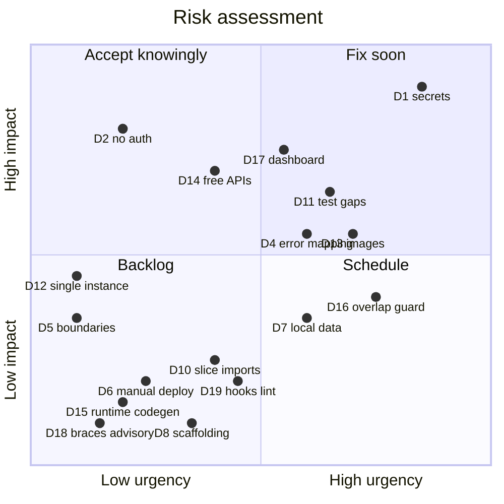

# 11. Risks and Technical Debt

Debt and risks identified while documenting the architecture. Severity is a proposal;
the owner decides what gets fixed and what gets accepted.

| # | Item | Where | Risk / impact | Proposed severity |
|---|------|-------|---------------|-------------------|
| D1 | **Secrets in plaintext config**: API keys, service credentials and connection details sit unencrypted in local configuration (the development file is gitignored) | gateway `appsettings.Development.json`; `ouranos-infrastructure` repo, `stacks/pantheon/.env` | No secrets manager anywhere in the stack; exposure via host compromise, environment inspection, or a locally built image (D13); key rotation is manual | High |
| D2 | **No authentication**: gateway is open by design ([security posture](08-crosscutting-concepts.md#813-security)) | [ADR 0008](../adr/0008-no-authentication-single-user.md) | Any host on the home network has full write access (delete strategies, import recipes); acceptable while network is trusted | Accepted (documented) |
| D4 | **No exception→status mapping**: only the framework's `AddProblemDetails()` is registered and there is no `UseExceptionHandler`; guard exceptions are unmapped, so a missing entity returns a bare 500 with no problem-details body instead of 404 | [Section 8.6](08-crosscutting-concepts.md#86-errors-and-validation) | Client errors are indistinguishable from server faults; the error contract stays accidental as the API grows | Medium |
| D5 | **Folder-enforced module boundaries**: single assembly per module; internal layering not compiler-enforced | [Section 5](05-building-block-view.md); trade-off in [4.2](04-solution-strategy.md#42-trade-offs-accepted) | A shortcut could couple module internals without failing the build | Low (accepted trade-off) |
| D6 | **Manual deployment step**: images are published by CI but promotion to the homelab is manual | [Section 7.4](07-deployment-view.md#74-cicd) | Deploy drift, forgotten migrations (mitigated: migrations run at startup) | Low |
| D7 | **No fast path to realistic local Plutus data**: data-heavy local work (signals, backtests) rides on full prod restores (large `pg_dump`s, slow dump/restore cycles); faking data is unexplored and risks diverging from real market distributions | Local development data flow | Slow iteration on data-heavy features; synthetic-data shortcuts could mislead signal/backtest tuning | Medium |
| D8 | **Unused scaffolding**: the notification outbox and its every-minute job have no sender implementation; the Shared module's WebSocket builders are used only by tests; an empty `HestiaDbContext` is still registered and migrated; frontend `src/proxy.ts` is a pass-through | Shared module, Hestia, interface | Readers assume capabilities that do not exist; dead code carries test and maintenance cost | Low |
| D10 | **Cross-slice type imports**: a few slices (strategy optimization and recommendations, signal history, shopping-list manual items) import another slice's schemas or pipeline steps | Plutus `Features/Strategies`, `Features/Signals`; Hestia `Features/ShoppingLists` | Slices are no longer independently changeable; shared types should move to the module's `Shared/` folder | Low |
| D11 | **Test gaps**: unit tests only (EF InMemory, substitutes), no integration tests against Postgres/TimescaleDB, RabbitMQ or Marten; frontend Vitest suite is not run in CI; the 85% gate covers .NET only | `tests/`, `.github/workflows/ci.yml` | Raw SQL, CAGG/materialized-view queries, messaging topology and frontend regressions can ship green | Medium |
| D12 | **Single-instance assumptions**: TickerQ runs in-process, output cache and `IMemoryCache` are per-process, overlap guards use in-memory flags | Shared `CoreExtensions`; Plutus jobs and caches | A second gateway replica would run every job twice and serve inconsistent cached data | Low (accepted while single host) |
| D13 | **Container image reproducibility**: images are tagged `:latest` only; the interface's API base URL is inlined at build time from the tracked `.env.production`; the gateway port is supplied by the infrastructure stack, not the image; `.dockerignore` does not exclude `appsettings.Development.json` | `src/apps/*/Dockerfile`, `.dockerignore`, `.github/workflows/ci.yml` | No rollback to a known build; runtime correctness depends on settings in the infrastructure repo; local builds can bake secrets (D1) | Medium |
| D14 | **Dependence on free external APIs**: Universalis, OSRS Wiki prices API, Alpaca free IEX feed, XIVAPI item data from GitHub | Plutus `Features/DataLoaders` | Rate limits, terms changes or outages stop ingestion with no fallback; IEX-only volume understates real activity for stock signals | Medium |
| D15 | **Wolverine runtime code generation** (`UseRuntimeCompilation`) | Shared `CoreExtensions` | Slower cold start and handler codegen failures surface at runtime, not build time; mitigated by `WolverineCodegenValidationTests` | Low |
| D16 | **Ineffective overlap guard**: `SymbolSignalCalculateJob` uses an `Interlocked` instance field, but TickerQ creates a new job instance per run, so the flag never sees a concurrent run | Plutus `Features/Signals/SymbolSignalCalculate` | If a run exceeds its 5-minute interval, runs may overlap, duplicating signal writes and view refreshes | Medium |
| D17 | **TickerQ dashboard unauthenticated**: `/tickerq/dashboard` is mapped with no auth | Shared `CoreExtensions` (`AddDashboard`) | Anyone on the network can inspect and trigger or alter scheduled jobs; a specific case of D2 with operational reach | Medium |
| D18 | **Unpatched `braces` advisory** (GHSA-vfj7-8cjw-p6xm, stack-exhaustion DoS): no fixed release exists; reached only via `eslint-config-next` → `@next/eslint-plugin-next` → `fast-glob@3.3.1` → `micromatch` | interface `package-lock.json` (dev dependency) | Lint-time only, on trusted glob patterns, so no runtime exposure; `npm audit` stays non-zero until upstream ships a fix | Low (accepted) |
| D19 | **React Compiler lint rules downgraded to warnings**: `react-hooks/set-state-in-effect`, `static-components` and `preserve-manual-memoization` flag pre-existing patterns (mostly dialogs resetting form state on open) | interface `eslint.config.mjs`; Hermes/Hestia/Plutus dialogs and detail pages | Cascading renders and stale-state bugs the rules guard against can still be introduced without failing CI | Low |

## 11.1 Risk Radar

Position is a proposal matching the severities above: urgency to act (x) against impact
if the risk materializes (y).

```mermaid
quadrantChart
    title Risk assessment
    x-axis Low urgency --> High urgency
    y-axis Low impact --> High impact
    quadrant-1 Fix soon
    quadrant-2 Accept knowingly
    quadrant-3 Backlog
    quadrant-4 Schedule
    D1 secrets: [0.85, 0.9]
    D2 no auth: [0.2, 0.8]
    D4 error mapping: [0.6, 0.55]
    D5 boundaries: [0.1, 0.35]
    D6 manual deploy: [0.25, 0.2]
    D7 local data: [0.6, 0.35]
    D8 scaffolding: [0.35, 0.1]
    D10 slice imports: [0.4, 0.25]
    D11 test gaps: [0.65, 0.65]
    D12 single instance: [0.1, 0.45]
    D13 images: [0.7, 0.55]
    D14 free APIs: [0.4, 0.7]
    D15 runtime codegen: [0.2, 0.15]
    D16 overlap guard: [0.75, 0.4]
    D17 dashboard: [0.55, 0.75]
    D18 braces advisory: [0.15, 0.1]
    D19 hooks lint: [0.45, 0.2]
```
